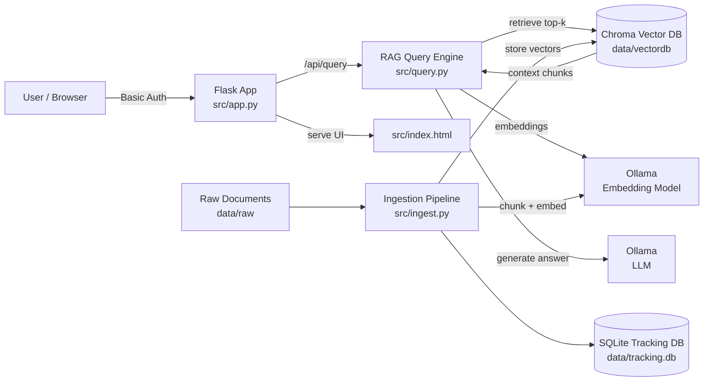
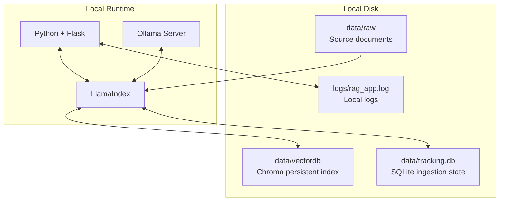

# Local AI MVP (Local-Only RAG Platform)

A local-first AI platform MVP that runs on your own machine and answers questions over your private documents using a Retrieval Augmented Generation (RAG) pipeline. The design goal is **user data security and sovereignty**: your documents stay on your device, the vector index is stored locally, and the LLM is served by a local Ollama runtime.

This repo is intentionally pragmatic: a working end-to-end prototype you can iterate on, benchmark, and harden.

## Visual overview





## Project structure

```text
localAImvp/
  README.md
  requirements.txt
  src/
    app.py
    config.py
    ingest.py
    query.py
    document_loaders.py
    document_tracker.py
    db_manager.py
    index.html
    auth_users.json
  data/
    raw/
    vectordb/
    tracking.db
  logs/
```

## Why this exists

Many “AI assistants” require sending sensitive data to external services. This project is a step toward an alternative:

- **Local-only by default**: document ingestion, embedding, vector search, and response generation happen on your machine.
- **Data sovereignty**: you control where data lives (files + local databases) and how it’s reset or removed.
- **Simple deploy surface**: a small Flask server with an HTML UI so you can test quickly.

## What it does (current capabilities)

- **Document ingestion** from `data/raw/` with chunking + embeddings
- **Persistent vector store** using **ChromaDB** on disk
- **Local embeddings + LLM** via **Ollama**
- **RAG querying** with LlamaIndex retrieval + similarity cutoff
- **Web app** (Flask) with a minimal UI and an `/api/query` endpoint
- **Basic authentication** (single user via env vars or multi-user via a local JSON file)
- **Local logging** with rotation
- **Document tracking** via SQLite to avoid re-ingesting unchanged files

## High-level architecture

- **UI**: `src/index.html`
- **API server**: `src/app.py` (Flask)
- **RAG query pipeline**: `src/query.py`
- **Ingestion pipeline**: `src/ingest.py`
- **Vector DB (persistent)**: `data/vectordb/` (Chroma)
- **Tracking DB (SQLite)**: `data/tracking.db` (document ingestion state)
- **Configuration**: `src/config.py` (paths, chunking, top-k, thresholds, model names)

## Local data model (what’s stored on disk)

- **Raw source documents**: `data/raw/`
- **Vector index**: `data/vectordb/`
- **Ingestion tracking**: `data/tracking.db`
- **Logs**: `logs/rag_app.log` (configurable)

If you want a clean start, you can delete the vector DB + tracking DB (see “Reset / start from scratch”).

## Quickstart

### 1) Prerequisites

- Python (create a venv recommended)
- Ollama installed and running

Install Python deps:

```bash
pip install -r requirements.txt
```

### 2) Start Ollama and pull models

This project expects a local Ollama server (default: `http://localhost:11434`).

Example (adjust to your hardware):

```bash
ollama pull nomic-embed-text
ollama pull llama3:latest
```

### 3) Add documents

Put your documents into:

- `data/raw/`

Supported formats are implemented in `src/document_loaders.py` (examples include `.txt`, `.md`, `.pdf`, `.docx`, `.csv`, `.json`, `.html`, `.xlsx`).

### 4) Ingest documents (build the local index)

```bash
python src/ingest.py
```

### 5) Run the web app

```bash
python src/app.py
```

Then open:

- `http://localhost:8000/`

## Configuration

Most defaults live in `src/config.py`:

- `OLLAMA_BASE_URL` (default `http://localhost:11434`)
- `LLM_MODEL` / `LLM_FALLBACK`
- `EMBED_MODEL`
- `CHUNK_SIZE`, `CHUNK_OVERLAP`
- `TOP_K`, `SIMILARITY_THRESHOLD`
- `VECTOR_DB_DIR`, `TRACKING_DB_PATH`, `COLLECTION_NAME`

Server settings are controlled via env vars in `src/app.py`:

- `RAG_APP_HOST` (default `0.0.0.0`)
- `RAG_APP_PORT` (default `8000`)
- `RAG_LOG_LEVEL` (default `INFO`)
- `RAG_LOG_FILE` (default `logs/rag_app.log`)
- `RAG_LOG_QUESTIONS` (default `true`) — consider setting this to `false` if you don’t want prompts in logs

Authentication options:

- **Single user**: `RAG_USER` / `RAG_PASS`
- **Local multi-user file**: `RAG_USER_FILE` (defaults to `src/auth_users.json` if present)

## Reset / start from scratch

To fully reset the local index and ingestion state:

- Delete `data/vectordb/`
- Delete `data/tracking.db`

Then re-run:

```bash
python src/ingest.py
```

Note: deleting `data/raw/` is optional and only needed if you also want to remove the source documents.

## Security & privacy posture (MVP)

This project is designed to keep your data local, but it is still an MVP. Current posture:

- **No built-in cloud dependency** for inference: the LLM + embeddings are served locally by Ollama.
- **Local persistence** only: Chroma + SQLite live on disk in `data/`.
- **Basic Auth only**: suitable for local networks and prototypes, not hardened for hostile environments.
- **Logging can include sensitive input** if enabled (`RAG_LOG_QUESTIONS=true`).

If you expose the Flask server beyond localhost, treat it like any other web service: restrict network access, set strong credentials, and review logs.

## Utilities

- Database inspection / integrity / listing:

```bash
python src/db_manager.py --stats
python src/db_manager.py --list
python src/db_manager.py --verify
python src/db_manager.py --check
```

## Roadmap ideas

- Stronger auth (sessions, hashed passwords, optional SSO)
- Per-user collections / isolation
- Encryption-at-rest options for local databases
- Better observability (structured logs, opt-in metrics)
- Packaging (Docker / installers) and more robust configuration

## Non-goals (for now)

- Cloud-hosted inference
- Multi-tenant security guarantees
- “Enterprise hardened” security without a dedicated threat model review
