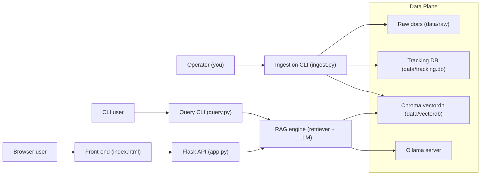
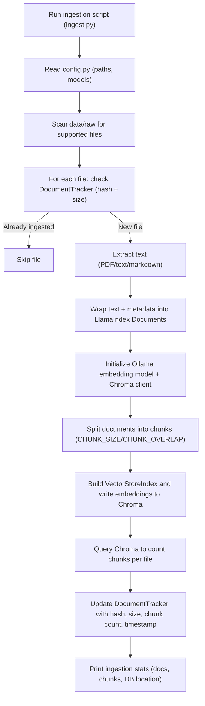
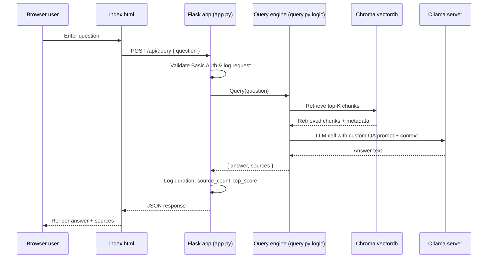
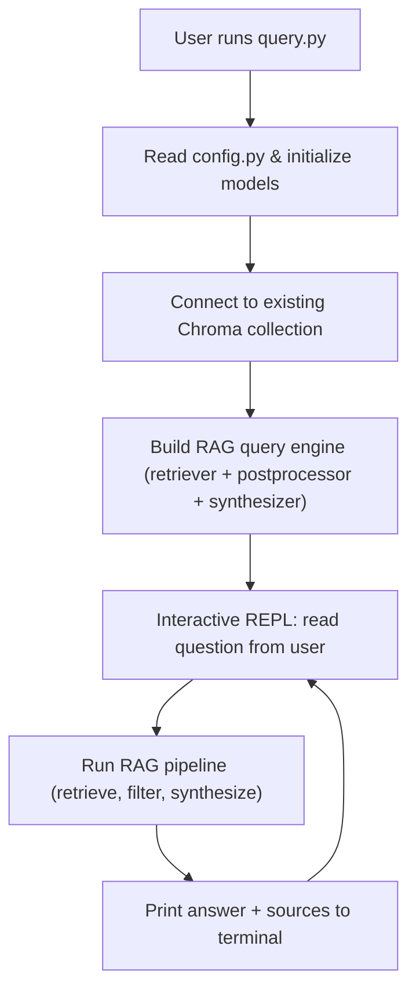
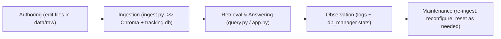

# RAG Prototype Project

## 1. Purpose and Overall Vision

This project implements a local, document‑centric RAG assistant with:

- **Local LLMs via Ollama** for both embeddings and generation.
- **ChromaDB** as a persistent vector store.
- **LlamaIndex** as the RAG orchestration layer (documents, indexing, retrieval, prompts).
- **A SQLite tracking DB** to manage which files have been ingested (and avoid duplicate ingestion).
- **Two UIs**:
  - A **command‑line** query interface.
  - A **password‑protected Flask web app** with a modern single‑page chat UI.
  
In effect, you have built a small but complete RAG “product”: ingestion, indexing, retrieval, answer synthesis, logging, auth, and a polished user interface.

---

## Quick-Start Checklist

Use this as the day-to-day TL;DR. For details, see sections 3, 9, 15, and 16.

1. **Check prerequisites**  
   - Python environment with required dependencies installed.  
   - Ollama running at `OLLAMA_BASE_URL` with `LLM_MODEL`, `LLM_FALLBACK`, and `EMBED_MODEL` available.  
   - Auth configured via `auth_users.json` or `RAG_USER` / `RAG_PASS`.
2. **Add or update documents**  
   - Place documents into `data/raw` (each file is treated as one document).
   - Supported formats: `.txt`, `.md`, `.pdf`, `.docx`, `.csv`, `.json`, `.html`, `.htm`, `.xlsx`, `.xls`.
3. **Run ingestion**  
   - Execute the ingestion pipeline to embed new documents and update `data/tracking.db`.  
   - Confirm the printed stats (documents processed, chunks, DB path) look correct.
4. **Quick sanity check via CLI**  
   - Use the CLI query interface to ask a few representative questions and verify that answers and sources are reasonable.
5. **Start the web app**  
   - Run the Flask app, then open the browser UI and log in via Basic Auth.  
   - Use the chat interface to query your documents and inspect sources.
6. **Monitor behavior**  
   - Watch logs (console or `logs/`) for errors, latency, and retrieval quality.  
   - Use `db_manager.py` periodically to review document coverage and chunk counts.
7. **Maintain and iterate**  
   - When documents or configuration change, re-run ingestion and, if needed, perform manual resets of `data/vectordb` and `data/tracking.db` in a coordinated way.

---

## 2. High-Level Architecture

At a high level, the system consists of:

- **Configuration layer (config.py)**
    - Central definitions for models, chunking, retrieval, and filesystem locations.
- **Document tracking (document_tracker.py + db_manager.py)**
    - Tracks which document files have been ingested, using a SQLite DB.
- **Ingestion pipeline (ingest.py)**
    - Loads raw files, splits them into chunks, computes embeddings, and persists them in ChromaDB.
    - Updates the tracking DB with ingest metadata.
- **RAG engine (query.py)**
    - Initializes LlamaIndex on top of the existing Chroma collection.
    - Configures retrieval and answer synthesis (prompt template, similarity filtering).
    - Exposes CLI query flows (interactive and single‑shot).
- **Web API and auth (app.py)**
    - Initializes a global query engine and exposes a `/api/query` endpoint.
    - Uses HTTP Basic Auth, with credentials either from a JSON file or environment variables.
- **Frontend chat UI (index.html)**
- A browser‑based chat interface that talks to `/api/query` and renders answers plus sources.
Data flow overview:

1. **Raw documents** are placed in `data/raw`.
2. **Ingestion** reads those files, chunk‑embeds them, and stores vectors in `data/vectordb` (Chroma).
3. **Tracking DB** in `data/tracking.db` records which file paths have been ingested and how many chunks each produced.
4. **RAG engine** connects to the existing Chroma collection and exposes a query interface.
5. **Web and CLI UIs** send natural‑language questions, receive answers and source snippets, and display them to the user.

---

## 3. Configuration and Environment

### 3.1 Model and RAG Settings (config.py)

Key aspects:

- **Ollama base URL**: Defaults to a local server on port 11434, overridable via environment.
- **LLM models**:
    - Primary model: configurable via environment, defaulting to a llama‑family model.
    - Fallback model: separate environment variable for a larger or different model (e.g., DeepSeek), used when the primary fails or is unavailable.
- **Embedding model**:
    - A separate Ollama embedding model name, used consistently across ingestion and querying.
- **RAG hyperparameters**:
    - Chunk size and overlap for the text splitter, tuned upward for better context continuity.
    - Top‑K retrieval count.
    - A similarity threshold used by a postprocessor to filter out low‑relevance chunks.
- **Filesystem structure**:
    - A `data` directory adjacent to src.
    - Subdirectories:
        - `data/raw` – where user documents are placed for ingestion.
        - `data/vectordb` – where ChromaDB persists its collection.
    - A tracking DB path within `data` for the SQLite file.

The configuration module ensures necessary directories exist at import time. This means:

- Running any part of the system that imports `config` will automatically create the required directories.
- The RAG system is very environment‑driven: changing env variables changes models and logging behavior without touching code.

---

## 4. Document Tracking Subsystem

### 4.1 Role and Design (document_tracker.py)

The tracking DB exists to **prevent re‑ingesting the same file contents** and to provide basic ingestion metadata.

The core component is a 

DocumentTracker class backed by SQLite:

- **Schema**:
    - Each row keyed by the full `file_path` (as a string).
    - Additional stored fields:
        - A SHA‑256 `file_hash` of the contents.
        - `file_size` in bytes.
        - `ingested_at` timestamp.
        - `num_chunks` (how many vector chunks were created).
        - `status` (string, defaulting to `"completed"`).
- **Indexes**:
    - On `file_hash` for potential future content‑based lookups.
    - On `ingested_at` for efficient sorting or time windows.
- **Key operations**:
    - is_document_ingested:
        
        - Recalculates the file’s hash and size.
        - Looks up the row by path.
        - Returns `True` only if the stored hash and size match current values.
        - Implication: If you modify a file in place, it will be treated as **not ingested** (even if the path is the same), prompting re‑ingestion if you adjust the ingestion logic; currently, ingest logic **skips** files already marked ingested, so this function is used basically as a gate.
    - mark_document_ingested:
        - Persists hash, size, timestamp, chunk count, and sets status to `"completed"`.
    - get_ingestion_stats:
        - Aggregates total documents, total chunks, and first/last ingestion times.
    - list_ingested_documents:
        - Returns a list of records with path, timestamp, chunk count, and status.
    - remove_document:
        - Deletes a tracking row for a given file path; does **not** delete the actual file or any vectors in Chroma.
    - verify_database_integrity:
        - Uses SQLite PRAGMA to validate DB health.
    
### 4.2 CLI Management (db_manager.py)

The DB manager CLI wraps the tracker with several commands:

- **show_stats**:
    
    - Prints summary counts and ingestion timestamps, and DB file location.
    
- **list_documents**:
    
    - Lists each ingested document with readable timestamps, chunk counts, and status.
    
- **check_new_documents**:
    
    - Scans `data/raw` for text, PDF, and markdown files.
    - Compares each to the tracking DB using is_document_ingested.
    - Reports which files are **not yet ingested** and thus ready for ingestion.
    - Encourages running the ingestion script to process them.
    
- **verify_integrity**:
    
    - Runs the integrity check and reports DB file presence and size.
    
- **remove_document_by_name**:
    
    - Accepts a filename (not full path), finds matching tracked entries.
    - If multiple matches exist, it warns and requires disambiguation; otherwise removes the single entry.
    - Notes explicitly that it does _not_ remove the underlying content or vectors.
    

The CLI is driven by `argparse`, with mutually combinable flags (`--stats`, `--list`, etc.) and an `--all` to run them all.

---

## 5. Ingestion Pipeline

### 5.1 Input Scope and Format Handling (ingest.py + document_loaders.py)

**UPDATE (Nov 2025)**: The ingestion system now supports multiple document formats through a modular loader architecture.

The ingestion script processes all files under `data/raw` matching these supported formats:

**Text-Based Documents:**
- Text (`.txt`)
- Markdown (`.md`)

**PDF Documents:**
- PDF (`.pdf`) - uses PyPDF2 for text extraction

**Microsoft Office:**
- Word (`.docx`) - extracts paragraphs and tables
- Excel (`.xlsx`, `.xls`) - processes all sheets, converts to structured text

**Data Formats:**
- CSV (`.csv`) - auto-detects delimiter, preserves structure
- JSON (`.json`) - formatted for readability

**Web Formats:**
- HTML (`.html`, `.htm`) - strips scripts/styles, extracts clean text

#### Architecture: Modular Document Loaders

The system uses a **separate `document_loaders.py` module** to handle format-specific loading:

**Design rationale:**
- **Separation of concerns**: Document loading logic is isolated from the ingestion pipeline
- **Maintainability**: Each loader is self-contained and easy to test/debug
- **Extensibility**: New formats can be added without modifying the main ingestion code
- **Minimal changes to ingest.py**: Only ~10 lines changed in the main pipeline

**Key components:**

1. **Base `DocumentLoader` class**: Abstract interface for all loaders
2. **Format-specific loaders**: Each implements the `load()` method for its file type
   - `TextLoader` - plain text and markdown
   - `PDFLoader` - PDF documents
   - `DocxLoader` - Word documents (requires `python-docx`)
   - `CSVLoader` - CSV files with auto-delimiter detection
   - `JSONLoader` - JSON files
   - `HTMLLoader` - HTML files (requires `beautifulsoup4`)
   - `ExcelLoader` - Excel files (requires `pandas` and `openpyxl`)

3. **Loader registry**: Maps file extensions to loader classes
4. **Unified interface**: `load_document(file_path)` function automatically selects the right loader

**Ingestion flow for each candidate file:**

- It consults the tracking DB:
    - If `is_document_ingested` returns true, the file is skipped as already ingested
    - Otherwise, it calls `load_document(file_path)` which:
        - Detects the file extension
        - Selects the appropriate loader from the registry
        - Returns extracted text or `None` if loading failed
    
- If the text is non‑empty, it creates a LlamaIndex `Document` with metadata:
    - Filename
    - File type (extension)
    - Full file path

This pipeline remains **document-level**: one `Document` per file, regardless of format.

**Graceful degradation:**
- If optional dependencies are missing (e.g., `python-docx` for Word files), the loader prints a helpful installation message
- Empty or error‑prone files are skipped with warnings
- Basic stats are printed at the end (new vs. skipped documents)

**Adding new formats:**
To add support for a new file type:
1. Create a new loader class in `document_loaders.py` inheriting from `DocumentLoader`
2. Implement the `load(file_path)` static method
3. Register the file extension in `LOADER_REGISTRY`
4. Add any required dependencies to `requirements.txt`

### 5.2 Vector Store Initialization

The ingestion script initializes a ChromaDB persistent client:

- Uses the `VECTOR_DB_DIR` from config as the path.
- Telemetry is explicitly disabled.

It then obtains or creates a collection with the configured name:

- There is **no delete/reset** logic currently active.
- Earlier design attempts at a `reset` mode (deleting the collection) are commented out everywhere.
- The effect: ingestion is append‑only at the vector store level; clean‑ups must be done manually if needed.

The collection is wrapped by a `ChromaVectorStore`, then used by LlamaIndex.

### 5.3 Chunking, Embedding, and Index Construction

Key steps during ingestion:

1. **Embedding model**:
    
    - An Ollama embedding model is instantiated with the configured name and base URL.
    - The global LlamaIndex `Settings.embed_model` is set to this instance.
    
2. **Text splitting**:
    
    - A sentence‑based splitter is configured with the configured chunk size and overlap.
    - These values are relatively large to give more context per chunk (helping answer synthesis).
    
3. **Index construction**:
    
    - A `StorageContext` points to the vector store.
    - A `VectorStoreIndex` is built from the documents, using the splitter as a transformation and showing a progress bar.
    
4. **Chunk count estimation and tracking update**:
    
    - After indexing, ingestion queries Chroma directly for all items, requesting metadatas.
    - It aggregates counts per `file_path` from the metadatas to find how many chunks belong to each file.
    - If this Chroma query fails (e.g., connectivity issues), it falls back to a rough estimate based on document length divided by the chunk size.
    - For each document, it:
        
        - Looks up the actual (or estimated) chunk count.
        - Calls the tracker to mark the document as ingested with that count.
        
    
5. **Reporting**:
    
    - The script prints a summary of documents processed and where the vector store lives.
    - It then prints updated ingestion stats from the tracking DB.
    

### 5.4 Incremental vs. Reset Semantics

The design is intentionally **incremental**:

- New ingestion runs only consider files not already marked as ingested in the tracking DB.
- Since collection deletion is turned off, existing embeddings remain in Chroma even as you add more documents.
- There is no built‑in orchestration to:
    
    - Re‑embed modified files automatically.
    - Remove embeddings for deleted files.
    - Hard‑reset the entire index and tracking DB together.
    

Instead, you rely on:

- Manually managing `data/vectordb` (e.g., deleting it for a hard reset).
- Using `db_manager` to remove or inspect tracked files.
- Potential future re‑activation of the commented‑out reset path if you need full refresh behavior.

---

## 6. Query Engine and RAG Behavior

### 6.1 Initialization (query.py)

The RAG engine initialization follows these steps:

1. **Embedding model**:
    
    - Creates an Ollama embedding model with the configured name and base URL.
    
2. **LLM with fallback**:
    
    - Tries to create a primary Ollama LLM with configured model name, base URL, a relatively long request timeout, and low temperature for focused answers.
    - If the primary fails (e.g., model not available, Ollama down), it logs the issue and tries to initialize the fallback model.
    - If both fail, it instructs the user to check their Ollama setup and raises an error.
    
3. **Global settings**:
    
    - Assigns the embedding and LLM to the global LlamaIndex `Settings`, so they are used consistently downstream.
    
4. **Vector store**:
    
    - Creates a Chroma persistent client pointing to the configured vector DB directory.
    - Tries to fetch the configured collection by name.
    - If the collection doesn’t exist (e.g., ingestion never run), it prints an error explaining that ingestion must be executed first, then exits the process.
    
5. **Index from vector store**:
    
    - Wraps the retrieved collection in a `ChromaVectorStore`.
    - Builds a `VectorStoreIndex` from the existing vector store, passing in the embed model.
    

The result is a **ready‑to‑use LlamaIndex index** layered on top of an existing Chroma collection, with proper embedding and LLM set up.

### 6.2 Retrieval and Answer Synthesis

The query engine is built around a combination of:

- **Retriever**:
    
    - A `VectorIndexRetriever` configured with:
        
        - The index created above.
        - `similarity_top_k` equal to your configured `TOP_K`.
        
    
- **Similarity postprocessor**:
    
    - A `SimilarityPostprocessor` with a configured similarity cutoff.
    - It filters out low‑relevance nodes after retrieval but before answer synthesis.
    - This reduces hallucination risk and improves answer focus by discarding weakly related chunks.
    
- **Custom QA prompt**:
    
    - A prompt template that:
        
        - Presents a structured “context” section containing the concatenated retrieved chunk texts.
        - Instructs the model to produce clear, comprehensive, and well‑structured answers.
        - Tells the model to explicitly say when the context is insufficient.
        - Encourages references to specific details and examples from the context.
        - Lays out a response structure (direct answer, supporting details, implications/considerations).
        
    
- **Response synthesizer**:
    
    - Uses LlamaIndex’s response synthesizer with:
        
        - The custom QA prompt as the text QA template.
        - A compact response mode to balance thoroughness and concision.
        
    
- **Retriever query engine**:
    
    - Combines retriever, response synthesizer, and the similarity postprocessor into a `RetrieverQueryEngine`.
    

This architecture implements a typical RAG pattern:

1. Retrieve top‑K candidate chunks.
2. Filter them by similarity threshold.
3. Provide filtered context and query string to the LLM via a structured QA prompt.
4. Let the LLM produce an answer that is grounded in that context.

### 6.3 Response Formatting and Source Exposure

The engine’s raw answer object is normalized into a dictionary with:

- An `answer` string: the textual answer from the LLM.
- A `sources` list: each entry representing one retrieved chunk, containing:
    
    - A human‑friendly chunk ID index.
    - A 300‑character preview of the chunk text.
    - The similarity score.
    - A metadata dict, typically including filename and full file path.
    

This structured output is crucial for:

- The CLI display of sources.
- The front‑end UI’s “Sources” panel, which expects this exact shape.

### 6.4 CLI Query Modes

The query script offers:

- **Interactive loop**:
    
    - A text‑mode REPL where the user can ask multiple questions until they type a quit command or interrupt with Ctrl‑C.
    - On each question:
        
        - It prints retrieval and generation status messages.
        - Queries the engine, formatting and printing answer and sources.
        
    
- **Single query mode**:
    
    - When called with arguments, it treats the arguments as a single question.
    - Prints the question, answer, and sources once, then returns.
    

### 6.5 Runtime Fallback Logic for OOM

Within the interactive loop, there is a specific error handling branch:

- If a query raises an exception whose text suggests an out‑of‑memory or generic server error (heuristically detected via substrings like “system memory” or “status code: 500”), the script:
    
    - Logs that the primary model failed due to insufficient memory.
    - Re‑instantiates the fallback LLM and reassigns it to the global LlamaIndex `Settings`.
    - Rebuilds the query engine using the existing index.
    - Repeats the query using the fallback engine.
    

This makes the system more resilient on constrained hardware, at the cost of some brittleness in error detection (string‑matching error messages).

---

## 7. Web API and Authentication

### 7.1 Logging Architecture (app.py)

The Flask app uses a dedicated logger with:

- **Configurable log level** via an environment variable.
- **Console logging** (always on).
- **Rotating file logging**:
    
    - Log directory placed alongside `data` (e.g., `logs`).
    - Log filename configurable via environment or default.
    - Max file size and backup count set to keep log volume bounded (~50MB total).
    

Logging is structured with a consistent format including timestamps, level, logger name, and message.

There is a forward‑looking comment block explaining how to extend logging into multiple logical streams (user activity, chat history, metrics, etc.), but this is not yet implemented.

### 7.2 Authentication Model

The app supports **HTTP Basic Auth** in two modes:

1. **JSON‑file‑backed users**:
    
    - If a user file environment variable or default auth_users.json exists, it:
        
        - Loads a JSON object mapping usernames to plaintext passwords.
        - Logs the auth mode and the number of users.
        - Uses these pairs in a lookup to validate credentials.
        
    
2. **Single env‑based user**:
    
    - If no JSON user file is found or load fails, it:
        
        - Falls back to a single username and password defined by environment variables with hardcoded defaults.
        - Logs mode as env_single_user.
        
    

Checking credentials:

- Each incoming request to protected endpoints passes through a decorator that:
    
    - Inspects the Authorization header.
    - Verifies the username and password.
    - If invalid or missing, returns a `401` response with the appropriate `WWW-Authenticate` header, prompting the browser to display a login dialog.
    

Security implications:

- Passwords are stored in plaintext in either a JSON file or environment.
- There is no password hashing or rate limiting.
- TLS/HTTPS is not handled by this code, so it is expected to be fronted by a TLS‑terminating reverse proxy if exposed beyond a trusted network.

### 7.3 RAG Engine Initialization in the Web App

When 

app.py is imported:

- It adds src to the Python path.
- Imports RAG initialization helpers from the query module.
- Immediately calls them to create:
    
    - A global index.
    - A global query engine.
    

RAG startup is logged, including which models are configured and the Ollama base URL.

Characteristics:

- Startup cost: indexing is not done here; it only reads from Chroma, but LLM and embedding model initialization still take some time.
- No runtime reloading: the engine is created once; to reflect newly ingested documents, you must restart the Flask app.

### 7.4 API Endpoints

The app exposes:

- **GET `/`**:
    
    - Protected by Basic Auth.
    - Serves the index.html chat UI.
    - Logs which user and client IP requested the UI.
    
- **POST `/api/query`**:
    
    - Protected by Basic Auth.
    - Expects a JSON body with a `question` field.
    - If the question is missing or empty, returns a `400` with an error message.
    

Within a valid request:

- It generates a unique request ID.
- Optionally logs a preview of the question (first 200 chars) and its length, depending on a configuration toggle:
    
    - When the toggle is off, question previews are blanked out, which is useful for privacy.
    
- It calls the global query engine with the question.
- It formats the result using the shared response formatter.
- It logs:
    
    - Duration in milliseconds.
    - Source count.
    - Top similarity score (if available).
    
- On success, it returns the result JSON to the client.

Error handling:

- Any unexpected exception is logged with a stack trace and request ID.
- The client receives a generic 500 response with the exception message as a string.

---

## 8. Front-End Chat UI

### 8.1 Layout and Interaction Model

The HTML front-end is a single‑page app consisting of:

- **A chat container** styled to mimic modern messaging apps:
    
    - Header with the assistant title, info icon, and theme toggle.
    - Scrollable messages pane.
    - Input area with text field and send button.
    
- **Messages**:
    
    - Two roles: user and assistant.
    - Visual differentiation via alignment, background colors, and labels.
    - Hover‑based action buttons on assistant messages (copy, regenerate placeholder).
    
- **Sources panel**:
    
    - For assistant messages that include sources:
        
        - A collapsible panel labeled “Sources”.
        - Lists each source chunk with:
            
            - Filename (from metadata: filename or file_path).
            - Text snippet.
            - Optional meta line containing chunk ID and similarity score.
            
        
    

### 8.2 Theme and UX Features

- **Light/dark theme**:
    
    - Theme stored in `localStorage` and defaults to the system preference.
    - Theme toggle updates a data attribute on the root and switches icons.
    
- **Info tooltip**:
    
    - Basic instructions for how to use the assistant.
    - Click‑to‑toggle behavior.
    
- **Input behavior**:
    
    - Enter key submits messages (with Shift+Enter reserved for multiline, though not fully exploited).
    - Send button is disabled when the input is empty.
    
- **Thinking indicator**:
    
    - When a request is sent:
        
        - A transient assistant “Thinking...” message is added.
        - It is removed once a response is received or an error occurs.
        
    

### 8.3 Backend Contract

The front end expects the RAG API at:

- POST `/api/query`, with JSON body `{ "question": "<user text>" }`.

It expects response JSON with:

- `answer`: string – the assistant’s answer.
- `sources`: list of objects, each with:
    
    - `chunk_id`: numeric or similar.
    - `text`: snippet string.
    - `score`: numeric.
    - `metadata`: object including `filename` or `file_path`.
    

This shape matches exactly the response from the backend formatter. Any deviation (e.g., missing keys, different field names) would break source rendering.

---

## 9. End-to-End Workflow Summary

### 9.1 Setting Up and Ingesting Documents

1. Ensure Ollama is running and the configured embedding and LLM models are available.
2. Place document files under `data/raw`:
    
    - Text, PDF, and markdown are supported.
    
3. Optionally run the DB manager to see what is new:
    
    - It will show which files are not yet in the tracking DB.
    
4. Run the ingestion script:
    
    - It will:
        
        - Scan for candidate files.
        - Skip ones already marked as ingested.
        - Load and chunk new files.
        - Embed and store vectors in Chroma.
        - Update the tracking DB with file- and chunk-level statistics.
        
    

### 9.2 Querying from the CLI

1. Ensure ingestion has been run at least once.
2. Run the query script without arguments:
    
    - It drops you into an interactive question‑answer loop.
    
3. Or provide a question as command‑line arguments for single‑shot answers.

### 9.3 Running the Web App

1. Ensure ingestion has been run (collection exists).
2. Set up authentication:
    
    - Either a JSON user → password mapping file, or environment variables for a single username/password.
    
3. Run the Flask app:
    
    - It initializes the RAG engine on startup and logs model and path information.
    
4. Visit the app in a browser:
    
    - Log in with Basic Auth credentials.
    - Use the chat UI to ask questions, view answers, and inspect sources.
    

---

## 10. Strengths of the Current Design

- **Clear separation of concerns**:
    
    - Config, ingestion, tracking, query engine, API, and UI are cleanly separated.
    
- **Environment-driven configurability**:
    
    - Models, logging, and auth can be adjusted without code changes.
    
- **Incremental ingestion design**:
    
    - DocumentTracker ensures you don’t repeatedly ingest the same files.
    - Ingestion is idempotent with respect to unchanged file paths.
    
- **RAG best practices**:
    
    - Use of embeddings + vector store + retrieval + similarity filtering + custom QA prompt.
    - Combining a retriever, similarity postprocessor, and response synthesizer is aligned with modern patterns.
    
- **Resilience features**:
    
    - LLM fallback both at initialization and at runtime on suspected OOM errors.
    - Logging of errors, durations, and top similarity scores.
    
- **User-facing polish**:
    
    - Web UI is visually clean, responsive, and includes quality‑of‑life features (themes, copy, sources).
    - CLI interfaces are user‑friendly with clear headers and messages.
    

---

## 11. Limitations, Edge Cases, and Design Trade-offs

- **No robust reset story**:
    
    - Reset functionality is partially implemented and commented out.
    - There is no “one shot” command to rebuild the index from scratch and reset the tracking DB.
    - Manual coordination is required if you delete vectors or want to re‑embed everything.
    
- **Tracking DB semantics**:
    
    - Deduplication is path‑based: a renamed duplicate file is treated as a new document.
    - The file hash is stored but not used for content‑based deduplication.
    - If you modify a file after ingestion, it remains marked as ingested, because ingestion consults is_document_ingested but the ingestion loop currently uses it only as a skip gate – you would need to adjust logic if you want auto re‑ingestion of changed files.
    
- **Vector store and tracking divergence**:
    
    - Removing a document from the tracking DB does not remove associated vectors from Chroma.
    - Removing files from `data/raw` does not automatically remove them from the vector store or tracking DB.
    - Hard resets require manual deletion of `data/vectordb` and potentially `data/tracking.db`.
    
- **Model and embedding consistency**:
    
    - The embedding model name is configurable but must remain consistent between ingestion and querying.
    - If you change the embedding model in config and rerun only the query engine (without re‑ingesting), you will be querying an index created with a different embedding space than the query embeddings, which degrades retrieval quality.
    
- **Error handling heuristics**:
    
    - Detection of OOM and server errors for fallback is string‑based and may miss or misclassify errors if upstream error messages change.
    
- **Security**:
    
    - Uses Basic Auth with plaintext passwords, no hashing.
    - No TLS at the application level; must rely on external infrastructure.
    - If question logging is enabled, potentially sensitive user queries are stored in logs.
    
- **Scalability considerations**:
    
    - Single global query engine in a single Flask process.
    - No explicit handling of concurrency or rate‑limiting.
    - No streaming responses; each answer is generated and returned as a whole.
    
- **No conversational memory**:
    
    - Each query is stateless and independent.
    - Conversation context is not stored or threaded into subsequent questions.
    - All context comes from vector retrieval only.
    

---

## 12. Recommended Next Steps and Extension Ideas

Depending on your goals for this project, key next steps could be:

- **Reset and re‑ingestion UX**:
    
    - Implement a safe, explicit “reset all” mode:
        
        - Deletes or recreates the Chroma collection.
        - Clears or reinitializes the tracking DB.
        - Re‑ingests current files.
        
    - Alternatively, implement per‑document re‑ingestion (tracked removal + vector purge).
    
- **Content-based deduplication**:
    
    - Use stored `file_hash` to detect duplicates even across different filenames.
    - Optionally store previous versions or support versioning.
    
- **Better sync between tracking DB and vector store**:
    
    - Add management utilities to:
        
        - Remove embeddings for a given file when its tracking record is deleted.
        - Verify that every tracked file has corresponding vectors and vice versa.
        
    
- **Security hardening**:
    
    - Introduce password hashing and salted storage for user credentials.
    - Encourage deployment behind HTTPS with reverse proxies.
    - Consider per‑user logging or audit logs if needed.
    
- **Observability and metrics**:
    
    - Add structured logs for:
        
        - Per‑request latency and error rates.
        - Token usage (if accessible from the LLM layer).
        
    - Consider metrics endpoints or integration with existing monitoring tools.
    
- **Conversational enhancements**:
    
    - Add conversation IDs and simple short‑term memory to allow follow‑up questions to refer to prior answers.
    - Store conversation logs in a separate DB or log stream.
    
- **RAG quality tuning**:
    
    - Experiment with:
        
        - Different chunk sizes and overlaps.
        - Different `TOP_K` and similarity thresholds.
        
    - Evaluate answer quality on typical queries and adjust defaults accordingly.
    
- **Front-end enhancements**:
    
    - Implement the “Regenerate” button to repeat queries (optionally with adjusted parameters).
    - Surface more metadata about sources (e.g., page numbers for PDFs).
    

---

## 13. How to Use This Document

You can use this review as:

- **Architecture reference**:
    
    - To recall how ingestion, tracking, vector store, and querying fit together.
    
- **Operational runbook**:
    
    - To remember where docs go, what scripts to run, and what logs and DBs exist.
    
- **Design reflection tool**:
    
    - To decide what to change next and understand the implications (e.g., resetting, security, quality tuning).
    
- **Onboarding guide**:
    - To bring another developer or future you quickly up to speed on the RAG system.

## 14. Detailed Component and Data Reference

### 14.1 Python Modules and Their Responsibilities

- **config.py**  
  Central configuration for models, RAG hyperparameters, and filesystem layout. It is imported by other modules and is effectively the single source of truth for:
  - Which Ollama models to use for embeddings and generation (primary and fallback).
  - Chunking, overlap, top-K, and similarity threshold used consistently across ingestion and query.
  - Where data lives on disk (`data/raw`, `data/vectordb`, `data/tracking.db`).

- **document_tracker.py**  
  Encapsulates all interaction with the SQLite tracking database. It is responsible for:
  - Creating and migrating the DB schema (tables and indexes) on initialization.
  - Computing file hashes and sizes to detect whether a file has already been ingested.
  - Recording ingestion metadata (time, number of chunks, status) for each file path.
  - Providing stats and listings for external tools (e.g., `db_manager.py`).

- **db_manager.py**  
  A CLI tool that exposes a human-friendly interface to `DocumentTracker`:
  - Shows aggregate ingestion statistics and DB file info.
  - Lists ingested documents with timestamps and chunk counts.
  - Compares the tracking DB with the contents of `data/raw` to identify new files.
  - Verifies basic DB integrity and supports removing an entry by filename.

- **document_loaders.py** *(NEW - Nov 2025)*  
  A modular document loading system that handles multiple file formats:
  - Provides a base `DocumentLoader` class and format-specific implementations.
  - Supports: `.txt`, `.md`, `.pdf`, `.docx`, `.csv`, `.json`, `.html`, `.htm`, `.xlsx`, `.xls`.
  - Uses a registry pattern to map file extensions to appropriate loaders.
  - Gracefully handles missing optional dependencies (e.g., `python-docx`, `pandas`).
  - Each loader extracts plain text from its specific format (e.g., tables from Word/Excel, clean text from HTML).
  - Exposes a unified `load_document(file_path)` function used by the ingestion pipeline.

- **ingest.py**  
  The ingestion pipeline, responsible for transforming raw files into embeddings stored in ChromaDB:
  - Scans `data/raw` for all supported file formats (via `document_loaders.py`).
  - Uses `DocumentTracker` to skip files that are already marked as ingested.
  - Delegates text extraction to `load_document()` from `document_loaders.py`.
  - Wraps extracted text into LlamaIndex `Document` objects with metadata.
  - Initializes the Ollama embedding model and Chroma persistent client.
  - Splits documents into chunks with a sentence-based splitter using configured size/overlap.
  - Builds a `VectorStoreIndex` backed by a Chroma vector store.
  - Counts chunks per source file (via Chroma metadata) and records them in the tracking DB.

- **query.py**  
  The core RAG runtime and query interface:
  - Initializes the embedding model and LLM (with fallback) and wires them into LlamaIndex global settings.
  - Connects to the existing Chroma collection (created during ingestion) and builds a `VectorStoreIndex` from it.
  - Configures a retriever, similarity postprocessor, and response synthesizer with a custom QA prompt.
  - Formats responses into a stable JSON-like structure with `answer` and `sources` for downstream consumers.
  - Provides a CLI query experience (interactive and single-shot) around the same query engine.

- **app.py**  
  The Flask web application/API layer:
  - Configures structured logging (console + rotating file) with log-level and file path driven by environment.
  - Handles authentication (JSON user file or single env-based user) via HTTP Basic Auth.
  - Initializes a global RAG index and query engine at startup using helpers from `query.py`.
  - Exposes a `/` route for serving the front-end and a `/api/query` route for answering questions.
  - Logs each request with request ID, timing, user, IP, and retrieval metrics (source count, top score).

- **index.html**  
  The single-page front-end:
  - Renders a modern chat-style UI with light/dark themes and a source panel per answer.
  - Sends user questions to `/api/query` as JSON and expects `answer` and `sources` in response.
  - Displays the model’s answer as plain text and the retrieved sources in a collapsible list.
  - Implements local UX concerns (input handling, copy-to-clipboard, "thinking" state) entirely in the browser.

- **auth_users.json**  
  A simple credential store used when `RAG_USER_FILE` is configured or defaults to this file:
  - Maps usernames to plaintext passwords.
  - Allows you to define multiple accounts without changing application code.

### 14.2 Data Stores and Files on Disk

- **Raw documents directory (`data/raw`)**  
  - Source of truth for what content can be ingested.
  - Supports `.txt`, `.pdf`, and `.md` files.
  - Files here are treated as immutable content units; each file becomes one logical document.

- **Vector database directory (`data/vectordb`)**  
  - ChromaDB’s persistent storage location.
  - Contains the vectors, metadatas, and Chroma’s internal state.
  - Deleting this directory effectively removes the entire vector index.

- **Tracking database (`data/tracking.db`)**  
  - SQLite file holding ingestion metadata per file path.
  - Used to avoid duplicate ingestion and to compute statistics.
  - Must remain consistent with `data/raw` and `data/vectordb` for the system to reflect reality.

- **Logs directory (`logs/` next to `data/`)**  
  - Stores rotating log files for the Flask app when file logging is enabled.
  - Used for debugging query problems, performance issues, and authentication errors.

- **Ollama model store (outside this repo)**  
  - Ollama maintains its own model cache and configuration.
  - This RAG system assumes Ollama is running and that the configured models are available there.

### 14.3 Environment Variable Reference

This section summarizes the main environment variables you can set to control behavior:

- **OLLAMA_BASE_URL**  
  Base URL for the Ollama server (default: `http://localhost:11434`).

- **LLM_MODEL**  
  Name of the primary LLM model for answer generation. Must correspond to a model available in Ollama.

- **LLM_FALLBACK**  
  Name of the fallback LLM model. Used when the primary model fails at init time or, in some paths, at query time due to OOM or server errors.

- **EMBED_MODEL**  
  Name of the embedding model served by Ollama. **Must remain consistent between ingestion and querying** to preserve embedding compatibility.

- **RAG_LOG_LEVEL**  
  Logging level for the Flask app (e.g., `INFO`, `DEBUG`, `WARNING`). Controls verbosity of logs.

- **RAG_LOG_FILE**  
  Optional override for the log file path. If unset, logs default to a file under `logs/`.

- **RAG_LOG_QUESTIONS**  
  Boolean-like toggle (`true`/`false`). When `true`, question previews are logged; when `false`, previews are blanked out for privacy.

- **RAG_USER_FILE**  
  Path to a JSON file mapping usernames to passwords. When provided and valid, the app uses multi-user JSON-based auth.

- **RAG_USER / RAG_PASS**  
  Single username/password pair used when a JSON user file is not configured or fails to load.

- **RAG_APP_HOST / RAG_APP_PORT**  
  Bind address and port for the Flask app. Default host is usually `0.0.0.0` and port defaults to `8000`.

- **FLASK_DEBUG**  
  Controls Flask’s debug mode and auto-reloader. Should be `false`-ish in production.

## 15. Architecture and Flow Diagrams (Text)

The following subsections provide text-based diagrams to help visualize how the pieces fit together.

### 15.1 High-Level Component Diagram

At a high level, there are three main interaction surfaces (CLI ingestion, CLI querying, and web app querying) over a shared data plane:

- **Data Plane (shared)**:
  - Raw files in `data/raw`.
  - Tracking DB in `data/tracking.db`.
  - Chroma vector store in `data/vectordb`.
  - Ollama server providing embeddings and LLM completions.

- **Ingestion Path**:
  - Operator (you) → `ingest.py` → `DocumentTracker` + Ollama embeddings → Chroma vector store.

- **Query Path (CLI)**:
  - User at terminal → `query.py` → RAG engine (retriever + LLM) → Chroma + Ollama.

- **Query Path (Web App)**:
  - Browser (index.html) → Flask app (`app.py`) → RAG engine (shared with `query.py` logic) → Chroma + Ollama.

You can think of Chroma and the tracking DB as the persistent core of the system, with ingestion and query layers sitting on top.

### 15.2 Ingestion Flow Diagram (Step-by-Step)

**Goal**: Turn raw files in `data/raw` into searchable embeddings while recording ingestion status.

High-level flow:

1. Operator runs the ingestion script.
2. `ingest.py` reads `config.py` to locate `data/raw`, `data/vectordb`, and `data/tracking.db`.
3. `ingest.py` scans `data/raw` for supported file types.
4. For each file found:
   - `DocumentTracker` is consulted to check if the file has already been ingested (via hash and size).
   - If already ingested, the file is skipped.
   - If new, the file’s text content is extracted (including PDF parsing when needed).
5. All new documents are converted to LlamaIndex `Document` objects with metadata (filename, type, path).
6. `ingest.py` initializes the Ollama embedding model and the Chroma persistent client.
7. A sentence-based text splitter uses `CHUNK_SIZE` and `CHUNK_OVERLAP` to break documents into overlapping chunks.
8. A `VectorStoreIndex` is built from the documents, pushing embeddings and metadata into Chroma (`data/vectordb`).
9. After indexing, ingestion queries Chroma’s collection to count how many chunks belong to each original file.
10. For each file, `DocumentTracker` records an entry with file hash, size, number of chunks, and ingestion timestamp.
11. Final statistics (total documents, total chunks, DB location) are printed for operator feedback.

### 15.3 Query Flow Diagram – Web App

**Goal**: Turn a browser question into an answer grounded in ingested documents.

Startup phase:

1. The Flask app (`app.py`) starts.
2. It imports `query.py` and calls the RAG initialization helpers.
3. `query.py` reads `config.py` to locate the Chroma vector store and model names.
4. `query.py` initializes the embedding model and LLM (with fallback) and binds them to LlamaIndex settings.
5. A persistent Chroma client opens the existing collection in `data/vectordb`.
6. A `VectorStoreIndex` is created on top of the Chroma collection.
7. A retriever, similarity postprocessor, and response synthesizer are assembled into a query engine.

Request/response phase for each question:

1. User opens the browser UI (index.html) and authenticates via HTTP Basic Auth.
2. The browser sends a POST request to `/api/query` with a JSON body containing the question.
3. `app.py`:
   - Validates credentials.
   - Generates a request ID and timestamps the start.
   - Optionally logs a preview of the question depending on `RAG_LOG_QUESTIONS`.
4. The global query engine receives the question and performs retrieval:
   - Uses the embedding model to encode the question.
   - Queries the Chroma vector store in `data/vectordb` for top-K similar chunks.
   - Applies the similarity cutoff to filter out weakly related chunks.
5. The remaining chunks are formatted into the custom QA prompt and fed to the LLM via Ollama.
6. The LLM produces an answer that LlamaIndex wraps into a response object.
7. `query.py`’s formatter converts the response object into a dictionary with `answer` and `sources`.
8. `app.py` logs the total duration, number of sources, and top similarity score.
9. The JSON result is returned to the browser.
10. The front-end renders the answer and a collapsible list of sources for the user.

### 15.4 Query Flow Diagram – CLI

The CLI query path is similar but bypasses Flask:

1. User runs `python src/query.py` (optionally with a question as command-line arguments).
2. `query.py` reads `config.py` and initializes the embedding model, LLM, Chroma client, and index as described above.
3. In interactive mode, it enters a REPL loop asking for questions until the user quits.
4. For each question:
   - The same RAG pipeline runs: embeddings → retrieval → similarity filtering → custom QA prompt → LLM.
   - The answer and sources are formatted.
   - The script prints the answer and a human-readable list of sources (filename, score, snippet) to the terminal.

### 15.5 Data Lifecycle Overview

You can think of the overall data lifecycle as:

1. **Authoring**: You place or update documents in `data/raw`.
2. **Ingestion**: `ingest.py` converts those documents into embeddings in Chroma and records ingest metadata in `data/tracking.db`.
3. **Retrieval & Answering**: `query.py`/`app.py` retrieve relevant chunks from Chroma and use the LLM to synthesize answers.
4. **Observation**: Logs and DB stats (via `db_manager.py`) let you observe ingestion coverage and query behavior.
5. **Maintenance**: As documents, models, or requirements change, you re-run ingestion, adjust config, or perform manual resets.

## 16. Running the System and Operational Practices

This section summarizes how to run the system end-to-end and highlights key operational considerations.

### 16.1 Prerequisites

- **Python environment**  
  - A working Python environment with the dependencies required by `ingest.py`, `query.py`, and `app.py` installed.  
  - Ensure the versions you install are compatible with ChromaDB, LlamaIndex, Flask, and PyPDF2.

- **Ollama server**  
  - Ollama must be running and reachable at `OLLAMA_BASE_URL` (default: `http://localhost:11434`).  
  - The configured `LLM_MODEL`, `LLM_FALLBACK`, and `EMBED_MODEL` must be pulled and available in Ollama.

- **Filesystem layout**  
  - When you first run any component that imports `config.py`, the `data/` directory and its subdirectories (`data/raw`, `data/vectordb`) are created automatically if missing.  
  - You generally should not manually edit `data/vectordb` or `data/tracking.db` unless you are performing a deliberate reset.

- **Authentication configuration**  
  - For the web app, decide whether you will use:  
    - A JSON user file (`RAG_USER_FILE` or default `auth_users.json`), or  
    - A single env-based user (`RAG_USER` / `RAG_PASS`).  
  - Make sure these values are set before starting the Flask app.

### 16.2 Typical Local Workflow

1. **Prepare documents**  
   - Place `.txt`, `.pdf`, and `.md` files into `data/raw`.  
   - Treat each file as one logical document.

2. **Optional: Inspect tracking DB**  
   - Use the DB manager CLI to see current status and new files waiting for ingestion.  
   - This tells you whether running ingestion will actually process anything new.

3. **Run ingestion**  
   - Execute the ingestion script to embed new documents and update the tracking DB.  
   - Ingestion is incremental: files already recorded as ingested (same path, same hash, same size) are skipped.

4. **Smoke-test via CLI query**  
   - Use the CLI query interface to check that retrieval works and that the RAG answers look reasonable before exposing the web UI.

5. **Run the web app**  
   - Start the Flask app and open the browser UI.  
   - Authenticate using your configured credentials and interact with the chat interface.

### 16.3 Running the Ingestion Pipeline

- **When to run ingestion**  
  - After adding new files to `data/raw`.  
  - After significantly modifying content of existing files (and optionally after clearing or updating tracking as needed).  
  - After changing RAG-relevant configuration that affects embeddings (especially `EMBED_MODEL`, `CHUNK_SIZE`, `CHUNK_OVERLAP`).

- **What ingestion does operationally**  
  - Scans `data/raw` and uses `DocumentTracker` to skip files already ingested.  
  - For new files, extracts text, chunks it, and writes embeddings and metadata into Chroma.  
  - Counts chunks per file via Chroma and records them into `data/tracking.db` with timestamps.  
  - Prints clear statistics so you can verify how many documents and chunks were processed.

- **Reset considerations**  
  - There is no single built-in "reset all" command; resets are manual and should be coordinated:  
    - Deleting `data/vectordb` removes all vector data.  
    - Deleting or recreating `data/tracking.db` clears ingestion history.  
  - If you reset either, be deliberate about re-ingesting documents to bring the system back into a consistent state.

### 16.4 Running the Web Application

- **Starting the Flask app**  
  - Ensure ingestion has run at least once so the Chroma collection exists.  
  - Set environment variables for host, port, log level, and auth as desired.  
  - Start the app and watch the logs for a line indicating successful RAG initialization (model names, Ollama URL) and server startup.

- **Accessing the UI**  
  - Navigate to the configured host and port in a browser.  
  - Provide the configured username and password when prompted by Basic Auth.  
  - Use the chat input to send questions; answers and sources should appear as described in earlier sections.

- **Operational logging**  
  - The app logs to console and optionally to a rotating file under `logs/`.  
  - For each request, you get: request ID, user, IP, question length, duration, number of sources, and top similarity score.  
  - Use `RAG_LOG_QUESTIONS` to control whether question previews are stored in logs.

- **Security posture**  
  - This app uses Basic Auth with plaintext passwords and assumes you front it with TLS if exposed beyond a trusted network.  
  - For private, local use, this is usually acceptable; for broader deployment, plan to harden auth and transport security.

### 16.5 Monitoring and Troubleshooting

- **Vector store not found**  
  - Symptom: initialization warns that the Chroma collection does not exist and suggests running ingestion first.  
  - Action: run the ingestion pipeline; confirm `data/vectordb` is populated.

- **Ollama connection issues**  
  - Symptom: errors about being unable to connect to Ollama or model unavailability.  
  - Action: ensure the Ollama server is running at `OLLAMA_BASE_URL` and that the configured models are pulled and ready.

- **Authentication failures**  
  - Symptom: repeated 401 responses from the web app.  
  - Action: verify `auth_users.json` (if used) is valid JSON with username/password pairs, or ensure `RAG_USER` / `RAG_PASS` are correctly set.

- **Embedding/LLM configuration drift**  
  - Symptom: degraded retrieval quality or inconsistent results after changing model names in config.  
  - Action: if you change `EMBED_MODEL`, re-run ingestion so that stored vectors and query-time embeddings share the same space.

- **Runtime errors on `/api/query`**  
  - Symptom: HTTP 500 responses from the API.  
  - Action: check the Flask logs (console or `logs/` files) for stack traces; errors often point to connectivity with Ollama or issues in the RAG pipeline.

Taken together with the earlier architectural and flow sections, this operational section should be enough to run, observe, and maintain the system with confidence.

## 17. Notes

1. To stop ollama run the following line in the terminal: " Get-Process | Where-Object {$_.ProcessName -like '*ollama*'} | Stop-Process"

## 18. Future Improvements

1. 
