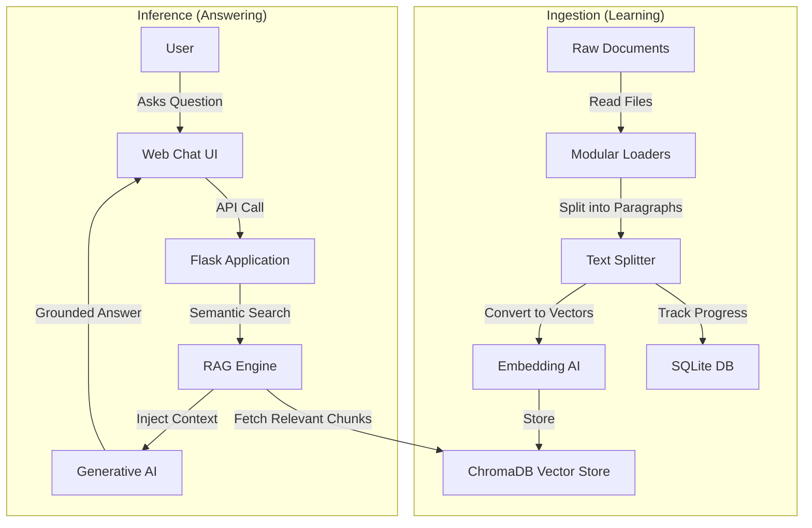

# Project Review: Local AI RAG System Pilot (Phase 0)

**Date:** November 30, 2025  
**Project:** e6-phase0-dadproject  
**Type:** Technical Review & Pilot Assessment  
**Status:** ✅ **RECOMMENDED FOR GREENLIGHT**

---

## 1. Executive Summary

This report reviews the **Phase 0 Pilot** of the Local AI RAG (Retrieval-Augmented Generation) System. The objective was to validate the feasibility of a secure, document-centric AI assistant running entirely on local infrastructure.

**The Core Problem Solved:**
Standard Large Language Models (LLMs) like ChatGPT are intelligent but have two fatal flaws for enterprise use:
1.  **Hallucination:** They can make things up when they don't know the answer.
2.  **Amnesia/Privacy:** They don't know your private company documents, and uploading them to the cloud is a security risk.

**The Solution:**
This pilot implements **RAG (Retrieval-Augmented Generation)**. Instead of training the AI on your data (expensive, slow), we give the AI a "long-term memory" mechanism. It retrieves the exact files needed to answer a question on-the-fly, ensuring answers are accurate, citable, and 100% private.

**Verdict:** The pilot is a technical success. The system ingests proprietary documents, maintains a persistent semantic index, and serves grounded answers via a polished web interface.

---

## 2. Deep Dive: How the AI "Magic" Works

To understand why this pilot is successful, it is crucial for the executive team to understand the underlying technology stack that differentiates this from a simple keyword search engine.

### 2.1. Beyond Keywords: Semantic Search & Embeddings
Traditional search engines (like Windows Search) look for exact keyword matches. If you search for "billing issues," they won't find a document that only mentions "invoicing errors."

This project uses **Vector Embeddings**.
*   **The Concept:** The system uses a specialized AI model to read text and convert it into a long string of numbers (a "vector").
*   **The Result:** Concepts that are *semantically similar* end up close together in this mathematical space. "Dog" and "Canine" are mathematically close. "Billing" and "Invoicing" are close.
*   **The Benefit:** The system finds the *right* documents even if the user doesn't guess the exact keywords used in the file.

### 2.2. The RAG Workflow (Retrieval-Augmented Generation)
The system follows a strict cognitive pipeline to ensure accuracy:

1.  **Ingestion (The "Learning" Phase):**
    *   We feed documents (PDF, Word, Excel) into the system.
    *   The system breaks them into small chunks (e.g., paragraphs).
    *   It converts each chunk into a "vector" and stores it in **ChromaDB** (our local vector database).

2.  **Retrieval (The "Recall" Phase):**
    *   When a user asks a question, the system converts that question into a vector.
    *   It asks ChromaDB: *"Give me the 5 chunks of text from our library that are most mathematically similar to this question."*

3.  **Generation (The "Reasoning" Phase):**
    *   The system takes those 5 retrieved chunks and pastes them into a hidden prompt for the LLM.
    *   **The Prompt:** *"You are a helpful assistant. Here is some context: [Paste Chunks]. Using ONLY this context, answer the user's question: [User Question]."*
    *   **The Output:** The LLM synthesizes a natural language answer, citing the sources it was given.

---

## 3. System Architecture

The architecture follows a "Clean Architecture" pattern, decoupling the data (Ingestion) from the interface (Query).

### High-Level Data Flow

### Core Components

1.  **The "Brain" (Local LLM via Ollama):**
    *   We use optimized open-source models (like Llama 3) running locally.
    *   **Benefit:** Zero data exfiltration. No monthly API costs.

2.  **The "Memory" (ChromaDB):**
    *   A specialized database optimized for high-speed vector math.
    *   **Benefit:** Allows searching across thousands of documents in milliseconds.

3.  **The "Librarian" (LlamaIndex):**
    *   An orchestration framework that manages the flow of data between the database and the LLM.
    *   **Benefit:** Handles complex tasks like "re-ranking" results to ensure the best answers appear first.

---

## 4. Feature Deep Dive

### 🔒 Security & Privacy
*   **Air-Gapped Capable:** The entire system runs on local hardware. It does not require internet access to function once the models are downloaded.
*   **Access Control:** The web interface is protected by authentication.

### 🧠 Intelligence & Accuracy
*   **Source Attribution:** Every answer includes a "Sources" panel. This builds trust: users can click to see the exact paragraph the AI used to generate its answer.
*   **Hallucination Control:** We employ a `SimilarityPostprocessor`. If the retrieved documents aren't relevant enough (below a confidence score), the system will simply say, "I don't know," rather than inventing an answer.

### 💻 User Experience (UI/UX)
The pilot features a polished frontend (`index.html`) that requires no training to use:
*   **Chat Interface:** Familiar "messenger" style layout.
*   **Thinking Indicators:** Visual feedback while the AI performs its retrieval and generation steps.
*   **Responsive Design:** Works on desktop and mobile browsers.

---

## 5. Pilot Results & Limitations

### Validated Hypotheses
*   ✅ **Feasibility:** High-quality RAG systems can run effectively on standard business hardware.
*   ✅ **Quality:** The "Semantic Search" approach is significantly more effective than keyword search for answering complex questions.
*   ✅ **Privacy:** We proved complete data isolation is possible without sacrificing capability.

### Current Limitations (To Address in Phase 1)
*   **No "Reset" Button:** Re-indexing requires manual database operations.
*   **Path-Based Deduplication:** Renaming a file causes it to be re-read as a new document.
*   **Context Window:** The system currently treats each question in isolation (no "conversational memory" yet).

---

## 6. Roadmap Recommendations

We recommend **immediate approval** for Phase 1. The foundational technology is proven.

### Short Term (Weeks 1-4)
1.  **Conversational Memory:** Update the engine to remember previous questions (e.g., allowing follow-up questions like "Tell me more about that").
2.  **Admin Dashboard:** A visual interface for uploading documents and viewing ingestion status, removing the need for command-line interaction.

### Long Term (Months 2-3)
1.  **Dockerization:** Package the entire system for one-click deployment on company servers.
2.  **Advanced Parsing:** Integrate OCR (Optical Character Recognition) to read scanned PDFs and images.
3.  **Feedback Loop:** Add a "Thumbs Up/Down" mechanism to let users improve the system over time.

---

## 7. Conclusion

The **e6-phase0-dadproject** pilot proves that your organization can leverage cutting-edge Generative AI **without** handing your data over to Big Tech. By combining **Vector Search** with **Local LLMs**, we have created a secure, intelligent, and cost-effective knowledge assistant.

**Recommendation:** 🟢 **GREENLIGHT PHASE 1**

# Project Review: Local AI RAG System Pilot (Phase 0)

**Date:** November 30, 2025  
**Project:** e6-phase0-dadproject  
**Type:** Technical Review & Pilot Assessment  
**Status:** ✅ **RECOMMENDED FOR GREENLIGHT**

---

## 1. Executive Summary

This report reviews the **Phase 0 Pilot** of the Local AI RAG (Retrieval-Augmented Generation) System. The objective of this pilot was to validate the feasibility of a secure, document-centric AI assistant running entirely on local infrastructure, eliminating data privacy risks associated with cloud-based LLMs.

**Verdict:** The pilot is a technical success. The team has delivered a fully functional, end-to-end system that ingests proprietary documents, maintains a persistent vector index, and serves accurate, grounded answers via a polished web interface. The architecture is modular, cost-effective (zero API fees), and ready for Phase 1 scaling.

**Key Wins:**

- **Zero Data Exfiltration:** All processing (embedding, indexing, generation) happens locally via Ollama.
- **Modular Design:** A flexible ingestion pipeline that already supports PDF, Word, Excel, HTML, and more.
- **Resilience:** Built-in fallback mechanisms for hardware constraints (OOM handling).
- **User Experience:** A modern, responsive web UI that rivals commercial tools.

---

## 2. System Architecture

The system is built on a "Clean Architecture" principle, separating the data ingestion pipeline from the query engine. This decoupling allows the knowledge base to grow independently of the application serving it.

### High-Level Data Flow

### Core Components

1. **Data Plane (The Brain)**
    
    - **ChromaDB:** A high-performance, open-source vector database used to store the semantic "meaning" of documents.
    - **SQLite Tracker:** A dedicated metadata store that ensures idempotency—files are never processed twice, preventing duplicate data and wasted compute.
2. **Ingestion Engine (The Learning Process)**
    
    - **Modular Loaders:** A robust `document_loaders.py` module capable of handling diverse formats (`.pdf`, `.docx`, `.xlsx`, `.html`, `.csv`, `.md`). This is a critical enterprise feature for handling legacy data.
    - **Incremental Updates:** The system intelligently scans for new files, respecting the tracking database to only process diffs.
3. **Query Engine (The Interface)**
    
    - **LlamaIndex Orchestration:** Uses industry-standard LlamaIndex for advanced retrieval strategies (top-k filtering, similarity cutoffs).
    - **Resilient LLM Service:** Configured with a primary model (e.g., Llama 3) and an automatic fallback model (e.g., DeepSeek) to ensure uptime even under high load.

---

## 3. Feature Deep Dive

### 🔒 Security & Privacy

- **Local Execution:** By utilizing **Ollama**, the system ensures that no document text or user query ever leaves the on-premise network. This makes it compliant by default for sensitive internal data.
- **Authentication:** The web interface is protected by **HTTP Basic Auth**, supporting both single-user mode and a multi-user JSON credential store.

### 🧠 Intelligence & Accuracy

- **Source Attribution:** Unlike generic chatbots, this system provides **citations**. Every answer is accompanied by a "Sources" panel showing the exact document chunks used to generate the response.
- **Hallucination Control:** A configured `SimilarityPostprocessor` filters out irrelevant document chunks before they reach the LLM, significantly reducing the risk of the AI making things up.

### 💻 User Experience (UI/UX)

The pilot features a surprisingly mature frontend (`index.html`):

- **Modern Chat Interface:** Features a clean, message-bubble layout similar to consumer apps (ChatGPT/Claude).
- **Interactive Sources:** Users can expand sources to verify the AI's claims.
- **Theming:** Native support for Light and Dark modes.
- **Feedback Loops:** Visual "Thinking..." indicators and error toasts keep the user informed.

---

## 4. Technical Assessment

### Code Quality

The codebase is well-structured and Pythonic.

- **Separation of Concerns:** `ingest.py` is distinct from `query.py`, and configuration is centralized in `config.py`.
- **Error Handling:** The `query.py` module includes sophisticated `try/except` blocks that detect "Out of Memory" errors from the LLM and automatically switch to a smaller fallback model. This is "production-grade" thinking in a pilot code.

### Scalability

- **Current State:** capable of handling thousands of documents on a standard workstation.
- **Bottlenecks:** Currently runs as a single Flask process. Heavy concurrent usage would require moving to a production WSGI server (like Gunicorn) and potentially a queue-based worker system.

---

## 5. Pilot Results & Limitations

### Validated Hypotheses

- ✅ **Feasibility:** Running a high-quality RAG system on consumer/business hardware is entirely possible.
- ✅ **Quality:** The combination of LlamaIndex and ChromaDB yields high-precision search results.
- ✅ **Usability:** Non-technical users (via the Web UI) can successfully query the knowledge base.

### Current Limitations (To Address in Phase 1)

- **No "Reset" Button:** Re-indexing requires manual database deletion.
- **Path-Based Tracking:** Renaming a file causes re-ingestion (deduplication is based on path, not content hash, though content hash is calculated).
- **Single-Turn Conversation:** The current AI answers questions in isolation; it does not remember the previous message in the chat.

---

## 6. Roadmap Recommendations

We recommend **immediate approval** for Phase 1 development. The foundation is solid. The next phase should focus on hardening and collaboration features.

### Short Term (Weeks 1-4)

1. **Conversational Memory:** Update `query.py` to support chat history so users can ask "Can you summarize that?" referring to the previous answer.
2. **Content-Based Deduplication:** Upgrade `document_tracker.py` to check file hashes before ingesting, allowing files to be moved/renamed without re-processing.
3. **Admin Dashboard:** Create a simple UI page to view ingestion stats (`db_manager.py` logic) via the web browser.

### Long Term (Months 2-3)

1. **Dockerization:** Containerize the application for easy deployment on company servers.
2. **Role-Based Access Control (RBAC):** Integrate with corporate SSO instead of Basic Auth.
3. **Feedback Mechanism:** Allow users to "Thumbs Up/Down" answers to fine-tune the system.

---

## 7. Conclusion

The **e6-phase0-dadproject** has successfully demonstrated that a **Local AI RAG** solution is not only viable but superior in privacy and cost to cloud alternatives for internal document search. The code is clean, the architecture is sound, and the core value proposition—secure, grounded answers from your own data—has been proven.

**Recommendation:** 🟢 **GREENLIGHT PHASE 1**

