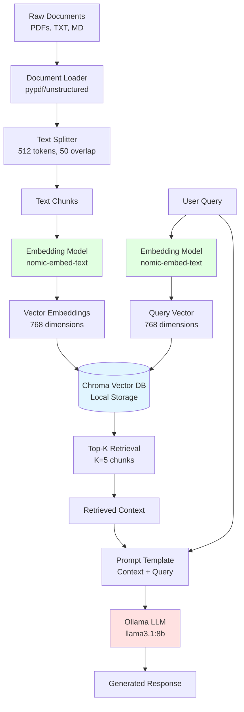
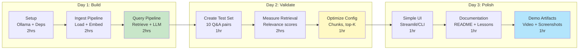
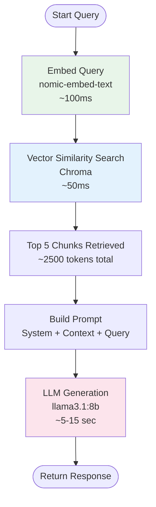
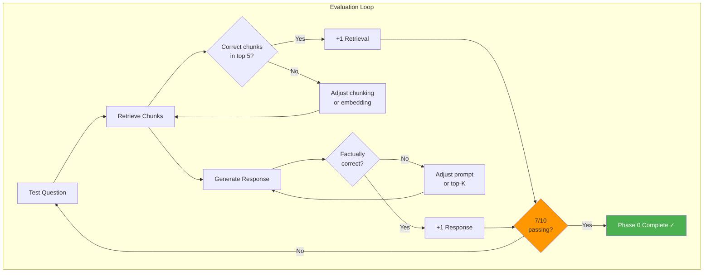
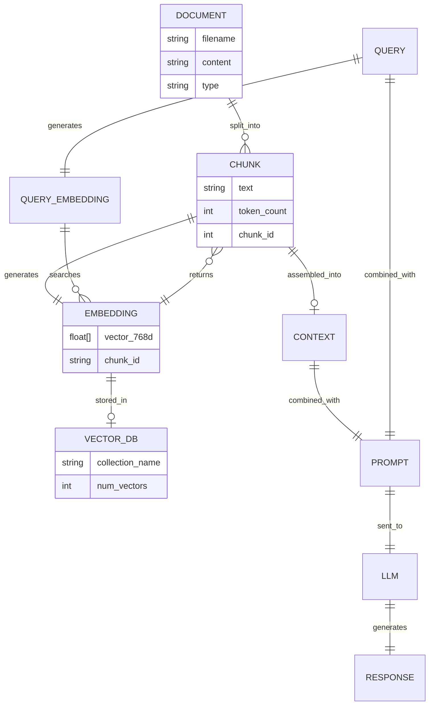
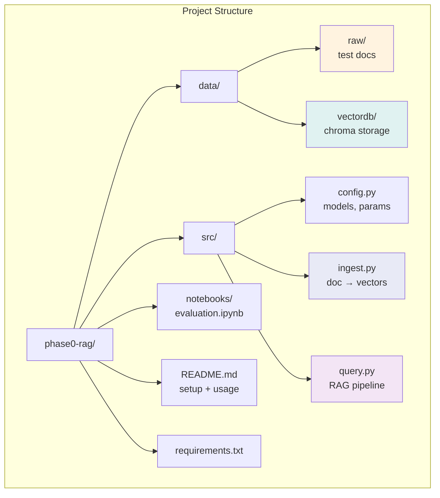
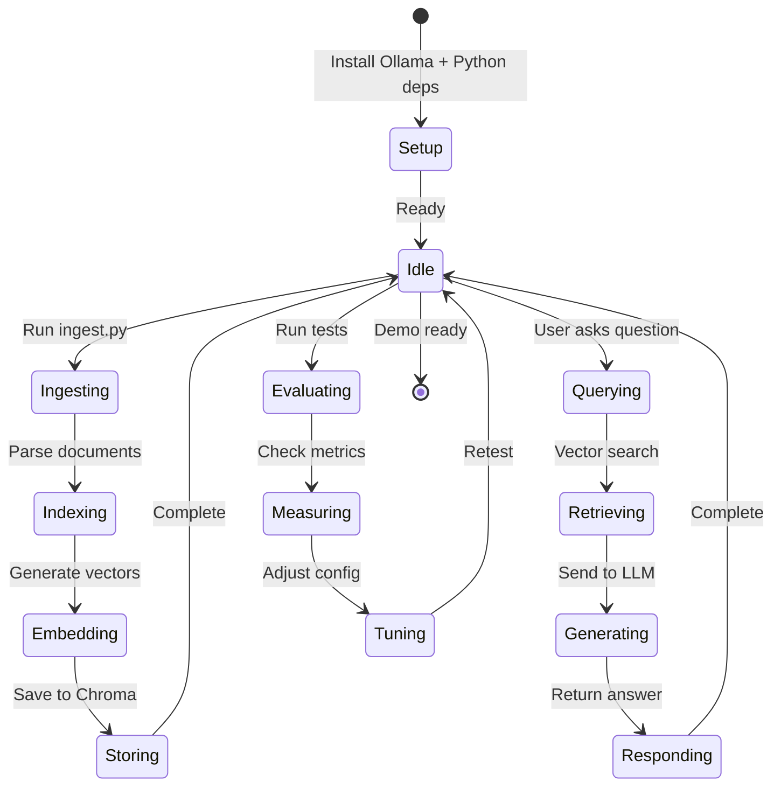

```mermaid
graph TD
    A[Raw Documents<br/>PDFs, TXT, MD] --> B[Document Loader<br/>pypdf/unstructured]
    B --> C[Text Splitter<br/>512 tokens, 50 overlap]
    C --> D[Text Chunks]
    D --> E[Embedding Model<br/>nomic-embed-text]
    E --> F[Vector Embeddings<br/>768 dimensions]
    F --> G[(Chroma Vector DB<br/>Local Storage)]
    
    H[User Query] --> I[Embedding Model<br/>nomic-embed-text]
    I --> J[Query Vector<br/>768 dimensions]
    J --> G
    G --> K[Top-K Retrieval<br/>K=5 chunks]
    K --> L[Retrieved Context]
    
    L --> M[Prompt Template<br/>Context + Query]
    H --> M
    M --> N[Ollama LLM<br/>llama3.1:8b]
    N --> O[Generated Response]
    
    style G fill:#e1f5ff
    style N fill:#ffe1e1
    style E fill:#e1ffe1
    style I fill:#e1ffe1
```

```mermaid
graph LR
    subgraph "Day 1: Build"
        A1[Setup<br/>Ollama + Deps<br/>2hrs] --> A2[Ingest Pipeline<br/>Load + Embed<br/>2hrs]
        A2 --> A3[Query Pipeline<br/>Retrieve + LLM<br/>2hrs]
    end
    
    subgraph "Day 2: Validate"
        B1[Create Test Set<br/>10 Q&A pairs<br/>1hr] --> B2[Measure Retrieval<br/>Relevance scores<br/>2hrs]
        B2 --> B3[Optimize Config<br/>Chunks, top-K<br/>1hr]
    end
    
    subgraph "Day 3: Polish"
        C1[Simple UI<br/>Streamlit/CLI<br/>1hr] --> C2[Documentation<br/>README + Lessons<br/>1hr]
        C2 --> C3[Demo Artifacts<br/>Video + Screenshots<br/>1hr]
    end
    
    A3 --> B1
    B3 --> C1
    
    style A3 fill:#c8e6c9
    style B3 fill:#fff9c4
    style C3 fill:#b3e5fc
```

```mermaid
flowchart TD
    Start([Start Query]) --> Embed[Embed Query<br/>nomic-embed-text<br/>~100ms]
    Embed --> Search[Vector Similarity Search<br/>Chroma<br/>~50ms]
    Search --> Retrieve[Top 5 Chunks Retrieved<br/>~2500 tokens total]
    Retrieve --> Build[Build Prompt<br/>System + Context + Query]
    Build --> LLM[LLM Generation<br/>llama3.1:8b<br/>~5-15 sec]
    LLM --> Response([Return Response])
    
    style Embed fill:#e8f5e9
    style Search fill:#e3f2fd
    style LLM fill:#fce4ec
```

```mermaid
graph TD
    subgraph "Evaluation Loop"
        Q[Test Question] --> R[Retrieve Chunks]
        R --> M1{Correct chunks<br/>in top 5?}
        M1 -->|Yes| Score1[+1 Retrieval]
        M1 -->|No| Fix1[Adjust chunking<br/>or embedding]
        
        R --> Gen[Generate Response]
        Gen --> M2{Factually<br/>correct?}
        M2 -->|Yes| Score2[+1 Response]
        M2 -->|No| Fix2[Adjust prompt<br/>or top-K]
        
        Fix1 --> R
        Fix2 --> Gen
        
        Score1 --> Final{7/10<br/>passing?}
        Score2 --> Final
        Final -->|Yes| Success[Phase 0 Complete ✓]
        Final -->|No| Q
    end
    
    style Success fill:#4caf50,color:#fff
    style Final fill:#ff9800
```

```mermaid
erDiagram
    DOCUMENT ||--o{ CHUNK : "split_into"
    CHUNK ||--|| EMBEDDING : "generates"
    EMBEDDING ||--o| VECTOR_DB : "stored_in"
    QUERY ||--|| QUERY_EMBEDDING : "generates"
    QUERY_EMBEDDING ||--o{ EMBEDDING : "searches"
    EMBEDDING ||--o{ CHUNK : "returns"
    CHUNK ||--o| CONTEXT : "assembled_into"
    CONTEXT ||--|| PROMPT : "combined_with"
    QUERY ||--|| PROMPT : "combined_with"
    PROMPT ||--|| LLM : "sent_to"
    LLM ||--|| RESPONSE : "generates"
    
    DOCUMENT {
        string filename
        string content
        string type
    }
    CHUNK {
        string text
        int token_count
        int chunk_id
    }
    EMBEDDING {
        float[] vector_768d
        string chunk_id
    }
    VECTOR_DB {
        string collection_name
        int num_vectors
    }
```

```mermaid
graph TB
    subgraph "Project Structure"
        Root[phase0-rag/]
        
        Root --> Data[data/]
        Data --> Raw[raw/<br/>test docs]
        Data --> VDB[vectordb/<br/>chroma storage]
        
        Root --> Src[src/]
        Src --> Config[config.py<br/>models, params]
        Src --> Ingest[ingest.py<br/>doc → vectors]
        Src --> Query[query.py<br/>RAG pipeline]
        
        Root --> NB[notebooks/<br/>evaluation.ipynb]
        Root --> README[README.md<br/>setup + usage]
        Root --> REQ[requirements.txt]
    end
    
    style Raw fill:#fff3e0
    style VDB fill:#e0f2f1
    style Ingest fill:#e8eaf6
    style Query fill:#f3e5f5
```

```mermaid
stateDiagram-v2
    [*] --> Setup: Install Ollama + Python deps
    Setup --> Idle: Ready
    
    Idle --> Ingesting: Run ingest.py
    Ingesting --> Indexing: Parse documents
    Indexing --> Embedding: Generate vectors
    Embedding --> Storing: Save to Chroma
    Storing --> Idle: Complete
    
    Idle --> Querying: User asks question
    Querying --> Retrieving: Vector search
    Retrieving --> Generating: Send to LLM
    Generating --> Responding: Return answer
    Responding --> Idle: Complete
    
    Idle --> Evaluating: Run tests
    Evaluating --> Measuring: Check metrics
    Measuring --> Tuning: Adjust config
    Tuning --> Idle: Retest
    
    Idle --> [*]: Demo ready
```
